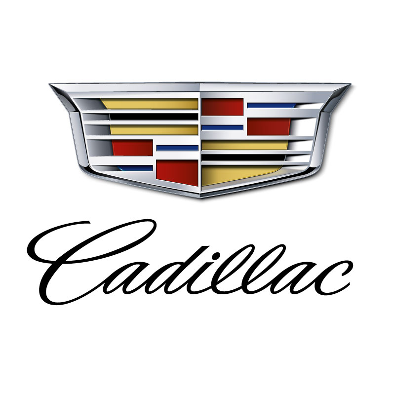

# ADS Project 1:  Car Brands in Lyrics

# Basic Idea

This project tries to analyze the car brands mentioned in lyrics.

# Conclusion
It seems like "Other" genre has the most cars mentioned. But have a look at the singers: "a-boogie-wit-da-hoodie", "asap twelvyy", "g-herbo"... are rappers so their songs should belong to "Hip-Hop". Thus the conclusion would be "Hip-Hop" songs mention cars most in our dataset. And among all car brands, "Cadillac" is singers' favourite choice.

